---

  

---

## 🚀 About Me

• Software Engineer at 2Cents Capital  
• Former SDE Intern at IIT Ropar   
• Gold Medalist – IndiaSkills 2024   
• Cross-Platform App Developer (Mobile & Web)   
• AI Engineer with focus on GenAI & Agentic AI  
• AR/VR Designer with real-world project experience   
• Public Speaker & Mentor

---

## 🌐 Socials:
    

---

# 💻 Tech Stack:
                                                          

<picture>
  <source media="(prefers-color-scheme: dark)" srcset="https://raw.githubusercontent.com/tobiasmeyhoefer/tobiasmeyhoefer/output/github-snake-dark.svg" />
  <source media="(prefers-color-scheme: light)" srcset="https://raw.githubusercontent.com/tobiasmeyhoefer/tobiasmeyhoefer/output/github-snake.svg" />
  
</picture>

---

# 📊 GitHub Stats:

---

## 🏆 GitHub Contribution
 
 

---

### ✍️ Dev Quote

---

### 🔝 Most Used Languages

---

## 🌟 Total Profile Visitors

---

<b>Made with ❤️ by Vansh</b>

